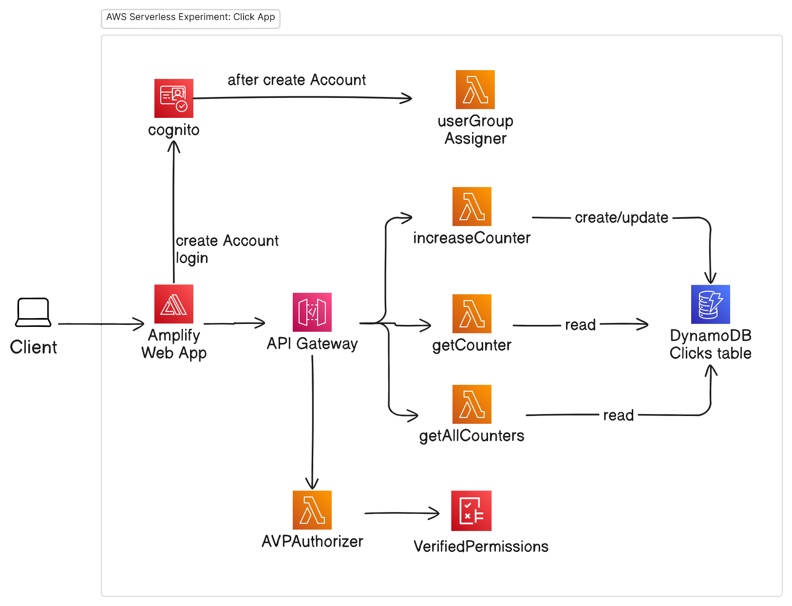

# Backend for KLiK app
This project is created to experiment with an AWS serverless backend.  

The python functions in this repository contain the code for the AWS Lambda functions which are used as the backend for the KLiK application.
At the moment there are 2 frontends that use this backend:
- Flutter frontend
  - code: https://github.com/edwinbulter/klik_flutter
  - web-app: https://main.dv7o5mle7kpe3.amplifyapp.com/
- React frontend
  - code: https://github.com/edwinbulter/klik_react
  - web-app: https://main.d3sz66opung9mh.amplifyapp.com/ 

## AWS Components:

## Sequence Diagram:

