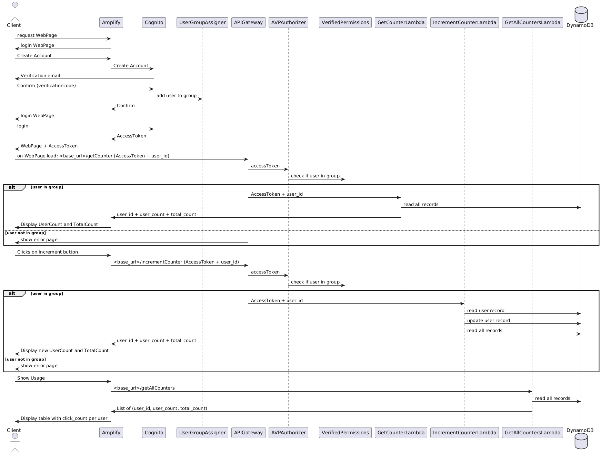

# Backend for KLiK app
This project is created to experiment with an AWS serverless backend and a Flutter and React frontend. 

The python functions in this repository contain the code for the AWS Lambda functions which are used as the backend for the KLiK application.
There are 2 frontends that use this backend:
- Flutter frontend
  - code: https://github.com/edwinbulter/klik_flutter
  - web-app: https://main.d1nbmlz8pl3t4z.amplifyapp.com/
- React frontend
  - code:
  - web-app: https://main.d3sz66opung9mh.amplifyapp.com/ 

## AWS Components:

## Sequence Diagram:

